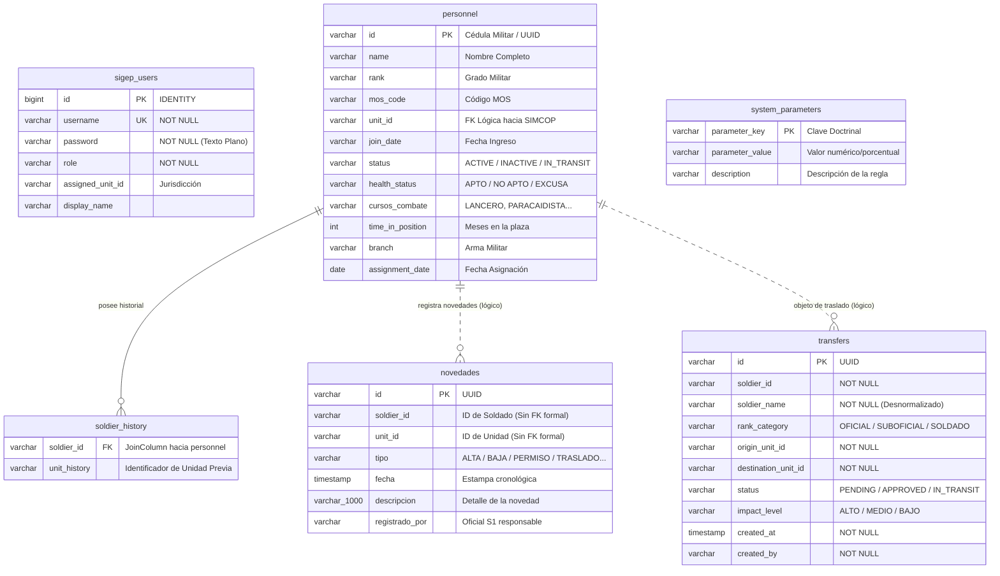
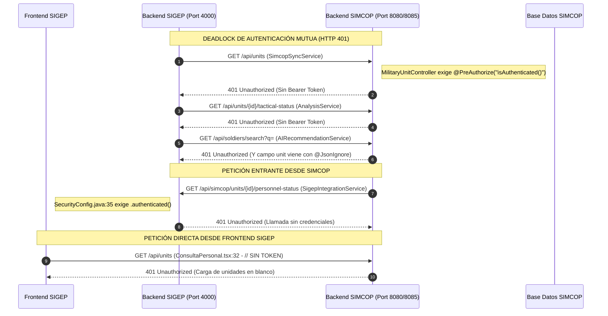

# INFORME TÉCNICO Y DOCTRINAL DE AUDITORÍA INTEGRAL: SUBSISTEMA SIGEP Y SU INTEROPERABILIDAD CON SIMCOP

---

## CONTROL DOCUMENTAL Y METADATOS

| Campo | Especificación |
|---|---|
| **Título del Documento** | Informe Técnico y Doctrinal de Auditoría Integral: Subsistema SIGEP y su Interoperabilidad con SIMCOP |
| **Identificador del Informe** | `INF-AUD-SIGEP-SIMCOP-2026-01` |
| **Código del Proyecto** | `SIGEP-SIMCOP-V1.0` |
| **Fecha de Emisión** | 5 de Septiembre de 2026 |
| **Clasificación de Seguridad** | **RESERVADO // CONTROL OPERACIONAL MILITAR** |
| **Entidad Emisora** | Equipo de Auditoría Técnica y Arquitectura de Sistemas de Información Militar |
| **Destinatarios Oficiales** | - Estado Mayor del Ejército Nacional de Colombia<br>- Jefatura de Estado Mayor de Operaciones (JEMOP / CEDE3)<br>- Jefatura de Estado Mayor de Personal (JEMPE / DIPER / G1 / S1)<br>- Dirección de Comunicaciones, Ciberdefensa y Telemática |
| **Repositorio Auditado** | `c:\DESARROLLOS\SIMCOP-main` (Módulos: `SIGEP/backend`, `SIGEP/frontend`, `backend/`, `frontend/`) |
| **Documento Maestro de Referencia** | *Especificación Técnica SIGEP: Gestión de Personal Militar y Sincronización con SIMCOP* (5 de Junio de 2026) |
| **Modo Operativo de Auditoría** | **Auditoría Forense de Sólo Lectura (*Strict Read-Only Audit Mode*) — Cero Modificación de Código Fuente** |

---

## TABLA DE CONTENIDOS

1. [Resumen Ejecutivo y Metodología de Auditoría](#1-resumen-ejecutivo-y-metodología-de-auditoría)
   - 1.1 Misión y Contexto Operacional
   - 1.2 Diagnóstico Técnico-Doctrinal Consolidado
   - 1.3 Metodología Forense de Auditoría
2. [Arquitectura General del Subsistema SIGEP](#2-arquitectura-general-del-subsistema-sigep)
   - 2.1 Visión Sistémica y Topología de Componentes
   - 2.2 Arquitectura Backend: Java 17 / Spring Boot 3.1.5
   - 2.3 Arquitectura Frontend: React 19.2.6 / Vite 8.0.12
   - 2.4 Diagramas Arquitectónicos del Sistema (ASCII y Mermaid)
3. [Modelos de Dominio, Persistencia y Mapeo Entidad-Relación](#3-modelos-de-dominio-persistencia-y-mapeo-entidad-relación)
   - 3.1 Catálogo Exhaustivo de Entidades del Dominio
   - 3.2 Relaciones JPA, Colecciones y Políticas de Carga
   - 3.3 Contraste Doctrinal: Modelo Esperado vs. Modelo Implementado
   - 3.4 Diagrama Entidad-Relación Completo (Mermaid)
   - 3.5 Diagnóstico de la Capa de Persistencia y Motor de Base de Datos
4. [Catálogo y Matriz Exhaustiva de Endpoints y Contratos de API](#4-catálogo-y-matriz-exhaustiva-de-endpoints-y-contratos-de-api)
   - 4.1 Matriz Consolidada de Endpoints REST de SIGEP (23 Puntos de Entrada)
   - 4.2 Especificación Detallada de Contratos de API, DTOs y Schemas JSON
   - 4.3 Discrepancias Críticas de Contrato Frontend ↔ Backend
5. [Mapeo Integral de la Interconexión e Interoperabilidad SIGEP ↔ SIMCOP](#5-mapeo-integral-de-la-interconexión-e-interoperabilidad-sigep--simcop)
   - 5.1 Topología de Red y Flujo de Interconexión
   - 5.2 Puntos de Conexión y Servicios Involucrados
   - 5.3 Diagnóstico del Deadlock de Autenticación Mutua (Rechazo 401 Bidireccional)
   - 5.4 Defecto Bloqueante en el Motor de Recomendación IA (`@JsonIgnore`)
   - 5.5 Desajuste de Puertos y Direccionamiento de Red
   - 5.6 Desconexión del Flujo de Eventos (Webhook Huérfano de Traslados)
6. [Análisis Doctrinal Comparativo: SIGEP vs SIOCH en SIMCOP](#6-análisis-doctrinal-comparativo-sigep-vs-sioch-en-simcop)
   - 6.1 Delimitación Doctrinal en las Fuerzas Militares de Colombia
   - 6.2 Alcance y Naturaleza de SIGEP: Gestión de Talento Humano Individual (G1/S1)
   - 6.3 Alcance y Naturaleza de SIOCH en SIMCOP: Cuadros Orgánicos y Mando Táctico (G3/S3)
   - 6.4 Matriz Comparativa: Administración Estatutaria vs. Empleo Táctico en el Terreno
   - 6.5 Interfaz de Enlace Orgánico y Mecanismo de Veto Táctico en Combate
7. [Auditoría de Conformidad: Especificación Técnica Oficial (PDF) vs Implementación Real](#7-auditoría-de-conformidad-especificación-técnica-oficial-pdf-vs-implementación-real)
   - 7.1 Marco Normativo del Documento Maestro (`SIGEP-SIMCOP-V1.0`)
   - 7.2 Matriz de Cumplimiento de Requisitos Funcionales (RF-01 a RF-25)
   - 7.3 Evaluación de Parámetros de Permanencia y Alertas Temporales
   - 7.4 Evaluación de los Tres Pilares de Retención Táctica (A, B y C)
   - 7.5 Brechas Críticas y Omisiones Funcionales
8. [Auditoría de Seguridad, Resiliencia y Calidad de Código](#8-auditoría-de-seguridad-resiliencia-y-calidad-de-código)
   - 8.1 Vulnerabilidades Críticas de Seguridad (P0/P1)
   - 8.2 Auditoría de Resiliencia y Alta Disponibilidad
   - 8.3 Calidad de Código, Deuda Técnica y Dependencias
9. [Matriz Consolidada de Hallazgos y Recomendaciones Priorizadas](#9-matriz-consolidada-de-hallazgos-y-recomendaciones-priorizadas)
   - 9.1 Taxonomía y Niveles de Severidad (P0 a P3)
   - 9.2 Tabla Maestra de Remediación Técnica
10. [Conclusiones y Hoja de Ruta de Evolución](#10-conclusiones-y-hoja-de-ruta-de-evolución)
    - 10.1 Dictamen Técnico Final
    - 10.2 Cronograma Fásico de Remediación e Integración

---

## 1. RESUMEN EJECUTIVO Y METODOLOGÍA DE AUDITORÍA

### 1.1 Misión y Contexto Operacional

El Sistema de Gestión de Personal Militar Sincronizado (**SIGEP**) fue proyectado para constituir el núcleo administrativo-operacional de la Dirección de Personal (S1/G1) del Ejército Nacional de Colombia. Su misión estatutaria consiste en dotar al mando militar de una plataforma automatizada para administrar los efectivos individuales, auditar en tiempo real la cobertura frente a la **Tabla de Organización y Equipo (TOE)**, controlar las rotaciones mandatorias de 24 meses para cuadros de mando (oficiales y suboficiales) en concordancia con el **Decreto Ley 1790 de 2000**, y arbitrar solicitudes de permanencia o prórrogas salvaguardando la capacidad combativa de las unidades en el terreno.

Para materializar este propósito, SIGEP fue concebido para operar en simbiosis bidireccional con el Sistema Integrado de Mando y Control Operacional (**SIMCOP**), permitiendo que las decisiones de talento humano (S1/G1) respeten irrestrictamente las restricciones tácticas impuestas por las operaciones de combate (S3/G3).

### 1.2 Diagnóstico Técnico-Doctrinal Consolidado

Tras un proceso de auditoría forense estricta y exhaustiva sobre la totalidad de los componentes de backend, frontend, configuraciones de red y bases de datos de ambos sistemas, se emite el siguiente dictamen consolidador:

```
+==================================================================================================+
|                        CUADRO DE MANDO INTEGRAL - DIAGNÓSTICO SIGEP                              |
+==================================================================================================+
|  DIMENSIÓN EVALUADA        | CALIFICACIÓN | ESTADO TÉCNICO / DICTAMEN FORENSE                    |
+----------------------------+--------------+------------------------------------------------------+
|  Madurez Doctrinal         | ALTA (85%)   | Excelente conceptualización de rotación (24m), TOE   |
|                            |              | del 80% y veto por combate. Falta Pilar C (AAR).     |
|  Integración Inter-Sistemas| NULA (0%)    | PARÁLISIS TOTAL. Deadlock mutuo HTTP 401 y defecto   |
|                            |              | de serialización @JsonIgnore que anula el motor IA.  |
|  Seguridad Criptográfica   | CRÍTICA (15%)| P0. Contraseñas en texto claro, secreto JWT quemado, |
|                            |              | BOLA/IDOR en expedientes y CORS universal (*).       |
|  Persistencia de Datos     | BAJA (30%)   | Base de datos H2 embebida con bloqueo de archivo,    |
|                            |              | ddl-auto=update sin Flyway y sin @Transactional.     |
|  Resiliencia y Red Táctica | DEFICIENTE   | Cero soporte offline (Air-Gap), RestTemplate sin     |
|                            |              | timeouts, fallback inseguro (TOE=0) y URLs quemadas. |
|  Calidad de Código         | MEDIA-BAJA   | 0 pruebas unitarias, bundle monolítico de 1.4 MB,    |
|                            |              | consultas findAll() en RAM y dependencia xlsx con CVE|
+==================================================================================================+
```

### 1.3 Metodología Forense de Auditoría

La auditoría se ejecutó bajo un protocolo de **Cero Modificación de Código Fuente (*Read-Only Audit*)**, asegurando que el estado del repositorio permanezca 100% limpio en Git. Se sintetizaron los hallazgos producidos por cinco líneas de investigación técnica especializada:
1. **Auditoría de Backend:** Análisis de clases Java, flujos Spring Security, ciclo de vida de beans y consultas Spring Data JPA.
2. **Auditoría de Frontend:** Inspección estática de componentes React, ciclos de vida de hooks, llamadas de red HTTP, bundles de compilación y linter.
3. **Minería de Especificación (PDF):** Extracción de 25 Requisitos Funcionales (RF), 18 Reglas de Negocio (RN) y contraste formal de brechas frente al documento oficial `SIGEP-SIMCOP-V1.0`.
4. **Auditoría de Interoperabilidad y SIOCH:** Trazado de rutas de red, análisis de cabeceras de autorización, inspección de payloads JSON y delimitación doctrinal entre personal (S1) y operaciones (S3).
5. **Auditoría de Seguridad y Resiliencia:** Evaluación de vulnerabilidades CWE, vectores BOLA/IDOR, concurrencia en almacenamiento y análisis de dependencias (CVE).

---

## 2. ARQUITECTURA GENERAL DEL SUBSISTEMA SIGEP

### 2.1 Visión Sistémica y Topología de Componentes

El subsistema SIGEP está estructurado como una solución desacoplada cliente-servidor compuesta por:
- **Capa de Presentación:** Single Page Application (SPA) construida en React 19 y Vite 8, optimizada para navegadores modernos con interfaz Glassmorphism táctica.
- **Capa de Servicios y Negocio:** Aplicación monolítica modular en Java 17 impulsada por Spring Boot 3.1.5, encargada de la lógica analítica de personal, validación de reglas de permanencia y exposición de APIs REST.
- **Capa de Persistencia:** Base de datos relacional SQL local gestionada mediante Hibernate ORM y Spring Data JPA sobre un motor embebido H2 Database.
- **Enlaces Externos:** Integración hacia SIMCOP mediante clientes HTTP REST (`RestTemplate`) y recepción pasiva de consultas.

### 2.2 Arquitectura Backend: Java 17 / Spring Boot 3.1.5

El backend se localiza en `SIGEP\backend` y comprende exactamente **30 archivos fuente Java**, estructurados bajo el paquete raíz `com.sigep`:

```
SIGEP/backend/src/main/java/com/sigep/
├── SigepApplication.java                 # Punto de entrada, CommandLineRunner, CORS y beans
├── controller/                           # 9 Controladores REST
│   ├── AIRecommendationController.java   # /api/ai/recommend-transfers
│   ├── AnalysisController.java           # /api/analysis/** (TOE, disponibilidad, viabilidad)
│   ├── AuthController.java               # /api/auth/login
│   ├── PersonnelController.java          # /api/personnel/** (CRUD, novedades)
│   ├── PersonnelQueryController.java     # /api/personnel/search, /{id}/dossier
│   ├── SimcopIntegrationController.java  # /api/simcop/units/{unitId}/personnel-status
│   ├── SystemParameterController.java    # /api/parameters (Doctrina operativa)
│   ├── TransferController.java           # /api/transfers/** (Workflow de rotación)
│   └── UserController.java               # /api/users/** (Directorio de operadores)
├── dto/                                  # 3 Data Transfer Objects
│   ├── AvailabilityDTO.java              # Desglose psicofísico (aptos, no aptos, etc.)
│   ├── ToeBalanceDTO.java                # Comparativa MOS (requerido vs actual)
│   └── TransferViabilityResult.java      # Dictamen analítico y reemplazos sugeridos
├── model/                                # 5 Entidades JPA
│   ├── Novedad.java                      # Registro del libro de guardia
│   ├── Soldier.java                      # Efectivo militar físico y capacidades
│   ├── SystemParameter.java              # Umbrales doctrinales configurables
│   ├── Transfer.java                     # Trámite de traslado de personal
│   └── User.java                         # Usuario del sistema y credencial RBAC
├── repository/                           # 5 Repositorios Spring Data JPA
│   ├── NovedadRepository.java            # Consultas cronológicas por unidad/soldado
│   ├── SoldierRepository.java            # Consultas de combatientes
│   ├── SystemParameterRepository.java    # Parámetros maestros
│   ├── TransferRepository.java           # Consultas de traslados por unidad y categoría
│   └── UserRepository.java               # Búsqueda de usuarios por username
├── security/                             # 3 Clases de Seguridad y Filtros
│   ├── AuthTokenFilter.java              # Interceptor OncePerRequestFilter para JWT
│   ├── JwtUtils.java                     # Generación y parseo criptográfico HS256
│   └── SecurityConfig.java               # SecurityFilterChain y reglas de ruta
└── service/                              # 4 Servicios de Lógica de Negocio
    ├── AIRecommendationService.java      # Algoritmo de rebalanceo de fuerza
    ├── AnalysisService.java              # Motor analítico TOE, rotación y viabilidad
    ├── SimcopSyncService.java            # Consumidor HTTP de unidades SIMCOP
    └── ToeAnalysisService.java           # Salvaguarda del 80% (Especialidades críticas)
```

#### Deficiencias Arquitectónicas del Backend:
1. **Antipatrón de Controladores Grasos (*Fat Controllers*):** Inexistencia de `PersonalService` y `UnidadService`. `PersonnelController`, `PersonnelQueryController`, `TransferController` y `UserController` inyectan directamente repositorios JPA y contienen lógica de negocio mutacional en sus métodos web.
2. **Ausencia Absoluta de `@Transactional`:** Ninguna clase o método del backend declara transaccionalidad, arriesgando inconsistencias ante excepciones en operaciones multi-tabla (como el registro de novedades con inactivación de soldados).
3. **Ausencia de Pruebas Automatizadas:** `pom.xml` no incluye `spring-boot-starter-test` y el directorio `src/test` no existe.

### 2.3 Arquitectura Frontend: React 19.2.6 / Vite 8.0.12

El frontend se localiza en `SIGEP\frontend` y opera como una aplicación web de una sola página sin `react-router-dom`, utilizando un enrutamiento por estado local (`activeTab`) en `App.tsx`:

```
SIGEP/frontend/src/
├── apiConfig.ts                          # URLs base de conexión (VITE_*)
├── App.tsx                               # Shell principal, Sidebar Glassmorphism y router
├── AuthContext.tsx                       # Contexto global de sesión e interceptores HTTP
├── index.css                             # Estilos Tailwind y directivas de diseño militar
├── main.tsx                              # Punto de montaje React 19 (StrictMode)
├── pages/
│   └── AnalysisDashboard.jsx             # Tablero táctico TOE vs Real (Recharts)
└── components/
    ├── Configuracion.tsx                 # Parámetros doctrinales y CRUD de usuarios
    ├── ConsultaPersonal.tsx              # Gestión de efectivos y selector de unidad
    ├── Dashboard.tsx                     # [COMPONENTE HUÉRFANO / CÓDIGO MUERTO]
    ├── DashboardNacional.tsx             # [COMPONENTE HUÉRFANO / APUNTA A 404]
    ├── FichaDigital.tsx                  # Expediente militar y cálculo de permanencia
    ├── Informes.tsx                      # Generador local de PDFs (jsPDF) y Excel (xlsx)
    ├── LibroNovedades.tsx                # Libro diario de novedades S1
    ├── Login.tsx                         # Formulario de autenticación táctica
    ├── RecomendacionIA.tsx               # Asesor táctico de rebalanceo asistido por IA
    ├── Recomendaciones.tsx               # Motor de alertas de déficit por MOS
    ├── TransferTray.tsx                  # [COMPONENTE HUÉRFANO / MOCK SIN CONEXIÓN]
    ├── TransferViabilityModal.jsx        # Modal de verificación algorítmica y override
    ├── TrasladoOficiales.tsx             # Workflow G1 para cuadros de mando
    ├── TrasladoSuboficiales.tsx          # Workflow B1 para mandos medios
    └── TrasladoSoldados.tsx              # Workflow para relevos masivos y soldados
```

#### Deficiencias Técnicas del Frontend:
1. **Componentes Huérfanos:** Tres componentes completos (`Dashboard.tsx`, `DashboardNacional.tsx`, `TransferTray.tsx`) permanecen en el repositorio sin estar importados ni referenciados en ningún archivo de la aplicación.
2. **Hibridez JSX / TSX:** Aunque el proyecto es TypeScript, `AnalysisDashboard.jsx` y `TransferViabilityModal.jsx` fueron escritos en JavaScript sin tipado estricto.
3. **Bundle Monolítico Gigante:** La compilación (`npm run build`) produce un único archivo de **1.4 MB** (`index-BE6gU_Yd.js`) debido a la ausencia de división de código (`React.lazy()`) para librerías pesadas como Recharts, jsPDF y SheetJS.

### 2.4 Diagramas Arquitectónicos del Subsistema

#### Diagrama de Arquitectura de Capas y Topología (ASCII):
```
+==================================================================================================+
|                                ARQUITECTURA GENERAL DEL SISTEMA                                  |
+==================================================================================================+

   [ CLIENTE NAVEGADOR WEB (Puesto de Mando S1/G1) ]
   │
   │ HTTP / JSON (Port 5173 / 5174)
   ▼
+──────────────────────────────────────────────────────────────────────────────────────────────────+
| FRONTEND SIGEP (React 19.2.6 + Vite 8.0.12)                                                      |
|  ├── Autenticación: AuthContext.tsx (Manejo de JWT y monkeypatching de fetch)                    |
|  ├── Inteligencia de Personal: AnalysisDashboard.jsx (BarChart TOE vs Real, PieChart Aptitud)    |
|  ├── Administración de Fuerza: ConsultaPersonal.tsx, FichaDigital.tsx, LibroNovedades.tsx        |
|  ├── Workflows de Traslado: TrasladoOficiales.tsx, Suboficiales.tsx, Soldados.tsx                |
|  ├── Asesoría Táctica e IA: Recomendaciones.tsx, RecomendacionIA.tsx, TransferViabilityModal.jsx |
|  └── Reportería Táctica: Informes.tsx (jsPDF-autotable, SheetJS xlsx)                            |
+──────────────────────────────────────────────────────────────────────────────────────────────────+
   │
   │ REST API / JSON (Puerto Local 4000)
   ▼
+──────────────────────────────────────────────────────────────────────────────────────────────────+
| BACKEND SIGEP (Java 17 + Spring Boot 3.1.5)                                                      |
|  ├── Capa de Seguridad: AuthTokenFilter, JwtUtils, SecurityConfig (Stateless JWT)                |
|  ├── Capa Controladores REST: Auth, Personnel, Transfer, Analysis, AI, Parameters, Users        |
|  ├── Capa de Servicios: AnalysisService, AIRecommendationService, SimcopSyncService             |
|  └── Capa de Persistencia: Spring Data JPA (5 Repositorios) + Hibernate 6.2                      |
+──────────────────────────────────────────────────────────────────────────────────────────────────+
   │                                                         ▲
   │ JDBC (jdbc:h2:file:./data/sigep-db)                     │ REST PULL / POST WEBHOOKS
   ▼                                                         │ (Puerto Local 8080 / 8085)
+──────────────────────────────────────+                     ▼
| BASE DE DATOS LOCAL SIGEP            |          +────────────────────────────────────────────────+
|  Motor: H2 Database 2.1.214          |          | SUBSISTEMA SIMCOP (Mando Operacional S3/G3)    |
|  Tablas:                             |          |  ├── MilitaryUnitController (/api/units)       |
|   - sigep_users                      |          |  ├── TacticalStatusController (/tactical-status|
|   - personnel                        |          |  ├── SoldierController (/api/soldiers)         |
|   - soldier_history                  |          |  ├── WebhookController (/transfer-completed)  |
|   - novedades                        |          |  └── SigepIntegrationService (Consulta SIGEP)  |
|   - transfers                        |          +────────────────────────────────────────────────+
|   - system_parameters                |                     │
+──────────────────────────────────────+                     ▼
                                                  +────────────────────────────────────────────────+
                                                  | BASE DE DATOS CENTRAL SIMCOP (MySQL 8)         |
                                                  |  Tablas: military_units, soldiers, etc.        |
                                                  +────────────────────────────────────────────────+
```

#### Diagrama de Arquitectura de Componentes y Flujos (Mermaid):
```mermaid
graph TD
    subgraph Frontend_SIGEP["Frontend SIGEP (React 19 / Vite)"]
        UI_Login["Login.tsx"]
        UI_AuthCtx["AuthContext.tsx<br/>(JWT Storage & Axios Interceptors)"]
        UI_App["App.tsx (Sidebar & Router)"]
        UI_Dash["AnalysisDashboard.jsx<br/>(Recharts TOE vs Real)"]
        UI_Personal["ConsultaPersonal.tsx<br/>(Master-Detail)"]
        UI_Dossier["FichaDigital.tsx"]
        UI_Novedades["LibroNovedades.tsx"]
        UI_Transfers["TrasladoOficiales / Sub / Soldados"]
        UI_ViabModal["TransferViabilityModal.jsx"]
        UI_AI["RecomendacionIA.tsx"]
        UI_Reportes["Informes.tsx (jsPDF / xlsx)"]
    end

    subgraph Backend_SIGEP["Backend SIGEP (Spring Boot 3.1.5 - Puerto 4000)"]
        Sec_Filter["AuthTokenFilter<br/>(Valida Bearer JWT)"]
        Sec_Config["SecurityConfig.java"]
        Ctrl_Auth["AuthController"]
        Ctrl_Pers["PersonnelController & Query"]
        Ctrl_Trf["TransferController"]
        Ctrl_Ana["AnalysisController"]
        Ctrl_AI["AIRecommendationController"]
        Ctrl_Param["SystemParameterController"]
        Ctrl_Simcop["SimcopIntegrationController"]

        Svc_Ana["AnalysisService"]
        Svc_AI["AIRecommendationService"]
        Svc_Sync["SimcopSyncService"]

        Repo_All["Spring Data Repositories<br/>(Soldier, Novedad, Transfer, User, Param)"]
    end

    subgraph Storage_SIGEP["Persistencia Local SIGEP"]
        DB_H2[("H2 Database Embebida<br/>sigep-db.mv.db")]
    end

    subgraph SIMCOP_System["Subsistema SIMCOP (Puerto 8080 / 8085)"]
        Simcop_Units["MilitaryUnitController<br/>(/api/units)"]
        Simcop_Tac["TacticalStatusController<br/>(/tactical-status)"]
        Simcop_Soldiers["SoldierController<br/>(/api/soldiers)"]
        Simcop_Hook["WebhookController<br/>(/transfer-completed)"]
        Simcop_Svc["SigepIntegrationService"]
        Simcop_DB[("Base de Datos SIMCOP<br/>MySQL 8")]
    end

    %% Conexiones UI a Backend
    UI_Login -->|POST /api/auth/login| Ctrl_Auth
    UI_App --> UI_AuthCtx
    UI_Dash -->|GET /api/analysis/toe-balance| Ctrl_Ana
    UI_Personal -->|GET /api/personnel/unit/{id}| Ctrl_Pers
    UI_Personal --> UI_Dossier
    UI_Personal --> UI_Novedades
    UI_Dossier -->|GET /api/personnel/{id}/dossier| Ctrl_Pers
    UI_Novedades -->|POST /api/personnel/novedades| Ctrl_Pers
    UI_Transfers -->|POST /api/transfers| Ctrl_Trf
    UI_Transfers --> UI_ViabModal
    UI_ViabModal -->|GET /api/analysis/viability| Ctrl_Ana
    UI_AI -->|GET /api/ai/recommend-transfers| Ctrl_AI

    %% Filtro de Seguridad
    Sec_Filter --> Sec_Config
    Sec_Config --> Ctrl_Pers
    Sec_Config --> Ctrl_Trf
    Sec_Config --> Ctrl_Ana
    Sec_Config --> Ctrl_AI

    %% Servicios y Lógica
    Ctrl_Ana --> Svc_Ana
    Ctrl_AI --> Svc_AI
    Ctrl_Pers --> Repo_All
    Ctrl_Trf --> Repo_All
    Svc_Ana --> Repo_All
    Repo_All --> DB_H2

    %% Interoperabilidad con SIMCOP (Con fallas)
    Svc_Sync -.->|GET /api/units (401 Error)| Simcop_Units
    Svc_Ana -.->|GET /tactical-status (401 Error)| Simcop_Tac
    Svc_AI -.->|GET /api/soldiers (401 & JsonIgnore)| Simcop_Soldiers
    Simcop_Svc -.->|GET /personnel-status (401 Error)| Ctrl_Simcop
    Ctrl_Trf -.->|Webhook no emitido (Roto)| Simcop_Hook
    Simcop_Units --> Simcop_DB
    Simcop_Soldiers --> Simcop_DB
```

---

## 3. MODELOS DE DOMINIO, PERSISTENCIA Y MAPEO ENTIDAD-RELACIÓN

### 3.1 Catálogo Exhaustivo de Entidades del Dominio

El backend de SIGEP implementa cinco entidades JPA en el paquete `com.sigep.model`:

#### 1. Entidad `User` (`com.sigep.model.User`)
- **Tabla:** `sigep_users`
- **Propósito:** Registro de operadores y comandantes autorizados para acceder a SIGEP.
- **Estructura de Columnas:**
  - `id` (`Long`): Clave primaria generada por identidad (`@GeneratedValue(strategy = GenerationType.IDENTITY)`).
  - `username` (`String`): Identificador único de inicio de sesión (`@Column(unique = true, nullable = false)`).
  - `password` (`String`): Credencial en **texto plano sin hashing** (`@Column(nullable = false)`).
  - `role` (`String`): Rol de seguridad (`@Column(nullable = false)`): `ROLE_ADMINISTRATOR`, `ROLE_EJERCITO`, `ROLE_DIVISION`, `ROLE_BRIGADA`, `ROLE_BATALLON`.
  - `assignedUnitId` (`String`): Jurisdicción militar asignada (`@Column(name = "assigned_unit_id")`). Puede ser `NATIONAL` o el identificador de una unidad (`BAT-101`).
  - `displayName` (`String`): Nombre militar formal del usuario.

#### 2. Entidad `Soldier` (`com.sigep.model.Soldier`)
- **Tabla:** `personnel` (Anotada con Lombok `@Data`)
- **Propósito:** Representación del combatiente físico individual, capacidades militares, condición psicofísica y permanencia.
- **Estructura de Columnas:**
  - `id` (`String`): `@Id`. Cédula Militar o identificador alfanumérico (`MIL_9018237`).
  - `name` (`String`): Nombre y apellidos completos del militar.
  - `rank` (`String`): Grado o rango militar (ej. `Subteniente`, `Sargento Primero`, `SLP`).
  - `mosCode` (`String`): Código de Especialidad Ocupacional Militar (ej. `MOS_11B_INF`, `MOS_68W_MED`).
  - `unitId` (`String`): Identificador foráneo lógico de la unidad física actual.
  - `joinDate` (`String`): Fecha de ingreso a la fuerza militar.
  - `status` (`String`, default `"ACTIVE"`): Estado administrativo (`ACTIVE`, `IN_TRANSIT`, `INACTIVE`).
  - `healthStatus` (`String`): Aptitud de sanidad (`APTO`, `NO APTO`, `EXCUSA MEDICA`, `LICENCIA`, `BAJA MEDICA`).
  - `cursosCombate` (`String`): Cadena delimitada por comas con cursos tácticos (ej. `"LANCERO, PARACAIDISTA"`).
  - `timeInPosition` (`Integer`): Meses acumulados en la posición o unidad actual.
  - `branch` (`String`): Arma militar (Infantería, Caballería, Artillería, Ingenieros, etc.).
  - `assignmentDate` (`java.time.LocalDate`): Fecha formal de asignación a la unidad actual.
- **Colección Secundaria Mapeada:**
  - `unitHistory` (`List<String>`): Mapeada con `@ElementCollection` y `@CollectionTable(name = "soldier_history", joinColumns = @JoinColumn(name = "soldier_id"))`. Registra la trayectoria cronológica de unidades donde ha servido el militar.

#### 3. Entidad `Novedad` (`com.sigep.model.Novedad`)
- **Tabla:** `novedades` (Lombok `@Data`)
- **Propósito:** Asiento del libro de novedades diario del servicio de personal.
- **Estructura de Columnas:**
  - `id` (`String`): `@Id @GeneratedValue(strategy = GenerationType.UUID)`. Identificador único UUID.
  - `soldierId` (`String`): Identificador del combatiente afectado.
  - `unitId` (`String`): Identificador de la unidad táctica donde ocurre la novedad.
  - `tipo` (`String`): Clasificación formal (`ALTA`, `BAJA`, `PERMISO`, `VACACIONES`, `LICENCIA_MEDICA`, `SANCION_DISCIPLINARIA`, `TRASLADO`).
  - `fecha` (`LocalDateTime`): Estampa cronológica del suceso.
  - `descripcion` (`String`): Glosa explicativa de hasta 1000 caracteres (`@Column(length = 1000)`).
  - `registradoPor` (`String`): Usuario u oficial S1 que asienta la novedad.

#### 4. Entidad `Transfer` (`com.sigep.model.Transfer`)
- **Tabla:** `transfers`
- **Propósito:** Trámite formal de traslados, validación de impacto y flujo de aprobación.
- **Estructura de Columnas:**
  - `id` (`String`): `@Id @GeneratedValue(strategy = GenerationType.UUID)`. UUID.
  - `soldierId` (`String`, `nullable = false`): Identificador del efectivo.
  - `soldierName` (`String`, `nullable = false`): Nombre desnormalizado para agilidad visual.
  - `rankCategory` (`String`, `nullable = false`): Categoría jerárquica (`OFICIAL`, `SUBOFICIAL`, `SOLDADO`).
  - `originUnitId` (`String`, `nullable = false`): Unidad origen.
  - `destinationUnitId` (`String`, `nullable = false`): Unidad destino propuesta.
  - `status` (`String`, `nullable = false`): Estado del trámite (`PENDING_APPROVAL`, `APPROVED`, `IN_TRANSIT`, `COMPLETED`, `REJECTED`).
  - `impactLevel` (`String`): Calificación del impacto en la fuerza (`ALTO`, `MEDIO`, `BAJO`).
  - `createdAt` (`LocalDateTime`, `nullable = false`): Fecha de radicación asignada vía `@PrePersist`.
  - `createdBy` (`String`, `nullable = false`): Usuario solicitante.

#### 5. Entidad `SystemParameter` (`com.sigep.model.SystemParameter`)
- **Tabla:** `system_parameters`
- **Propósito:** Parametrización dinámica de políticas y umbrales doctrinales militares.
- **Estructura de Columnas:**
  - `parameterKey` (`String`, `@Id`): Clave única doctrinal.
  - `parameterValue` (`String`): Valor numérico o porcentual.
  - `description` (`String`): Descripción doctrinaria de la regla.

### 3.2 Relaciones JPA, Colecciones y Políticas de Carga

1. **Desacoplamiento Relacional Estricto (Sin Foreign Keys):**
   No existen anotaciones `@ManyToOne` ni `@OneToMany` entre `Novedad`, `Transfer` y `Soldier`. Todas las referencias se realizan mediante cadenas de texto plano (`soldierId`, `unitId`).
   - *Impacto:* El motor JPA no valida la existencia previa del combatiente al registrar un traslado o novedad, arriesgando la persistencia de registros huérfanos.
2. **Colección `@ElementCollection`:**
   La única relación relacional explícita es `Soldier.unitHistory`, la cual crea la tabla secundaria `soldier_history`. Utiliza la política de carga por defecto `FetchType.LAZY`.
3. **Ausencia de Cascadas (`CascadeType`):**
   Al no existir relaciones directas, no hay cascadas de actualización o eliminación.

### 3.3 Contraste Doctrinal: Modelo Esperado vs. Modelo Implementado

| Concepto Doctrinal (PDF) | Modelo Esperado en Especificación | Implementación Real en Backend SIGEP | Evaluación Técnica y Brecha |
|---|---|---|---|
| **Personal Militar** | Entidad rica con historial de combate, índice táctico y restricciones. | `Soldier` (`personnel`) con `@ElementCollection unitHistory`. | **Alineado al 80%**. Cumple con permanencia, cursos y sanidad. Falta índice AAR. |
| **Unidad Militar** | Entidad relacional local con jerarquía, coordenadas y dotación TOE. | **Inexistente como entidad JPA**. Se maneja como `String unitId` y se consulta a SIMCOP. | **Desacoplado**. Depende al 100% de la conectividad en vivo con SIMCOP. |
| **Especialidad (MOS)** | Catálogo maestro normalizado de especialidades ocupacionales. | **Inexistente como entidad**. Cadena `mosCode` libre en `Soldier`. | **Riesgo de Inconsistencia**. Errores tipográficos (`moceCode`) no son prevenidos. |
| **Rango / Grado** | Catálogo jerárquico formal con orden de precedencia y escala salarial. | **Inexistente como entidad**. Cadena `rank` libre en `Soldier`. | **Frágil**. La categorización de oficiales/suboficiales depende de `contains()`. |
| **Hoja de Vida** | Expediente digital consolidado con persistencia propia. | **DTO virtual al vuelo**. `PersonnelQueryController.getDossier()` ensambla Soldier + Novedades. | **Funcional**. Genera el expediente sin requerir tabla adicional. |
| **Prórroga / Retención** | Entidad formal `ExtensionRequest` con causales y balanza de riesgos. | **Inexistente en base de datos**. Solo existe campo de override en modal frontend. | **Brecha Crítica**. No hay registro histórico de solicitudes de prórroga denegadas. |

### 3.4 Diagrama Entidad-Relación Completo (Mermaid)



### 3.5 Diagnóstico de la Capa de Persistencia y Motor de Base de Datos

1. **Persistencia Embebida Inadecuada para Producción Militar:**
   - La cadena de conexión `spring.datasource.url=jdbc:h2:file:./data/sigep-db` utiliza H2 en modo archivo exclusivo.
   - **Fallo de Concurrencia Documentado:** En `SIGEP\backend\data\sigep-db.trace.db` (líneas 2-3 y 189-190) se registran excepciones bloqueantes:
     ```
     org.h2.message.DbException: Error General : "org.h2.mvstore.MVStoreException: The file is locked: C:/DESARROLLOS/SIMCOP-main/SIGEP/backend/data/sigep-db.mv.db [2.1.214/7]"
     ```
     Si dos procesos intentan abrir el archivo (ej. Spring Boot y la consola H2 externa), el sistema colapsa de forma irrecuperable.
2. **Evolución no Controlada del Esquema:**
   - Se utiliza `spring.jpa.hibernate.ddl-auto=update`. Hibernate muta la base de datos automáticamente al arrancar.
   - No existen scripts versionados con herramientas empresariales como **Flyway** o **Liquibase**, impidiendo auditorías de cambios sobre la estructura de datos clasificados.
3. **Credenciales Inseguras por Defecto:**
   - Usuario `sa` y contraseña `password` expuestos en `application.properties`.

---

## 4. CATÁLOGO Y MATRIZ EXHAUSTIVA DE ENDPOINTS Y CONTRATOS DE API

### 4.1 Matriz Consolidada de Endpoints REST de SIGEP

El subsistema backend de SIGEP expone **23 endpoints operacionales**:

| # | Controlador | Método | Ruta del Endpoint | Rol / Seguridad | Parámetros / Body | Respuesta JSON / Status |
|---|---|:---:|---|---|---|---|
| **1** | `AuthController` | `POST` | `/api/auth/login` | `permitAll()` | Body: `{"username", "password"}` | `200 OK`: `{"token", "username", "role", "unitId"}`<br>`401`: Credenciales inválidas |
| **2** | `UserController` | `GET` | `/api/users` | `authenticated()` | Ninguno | `200 OK`: `List<User>` (**Expone passwords en texto plano**) |
| **3** | `UserController` | `POST` | `/api/users` | `authenticated()` | Body: `User` JSON | `200 OK`: `User` persistido |
| **4** | `UserController` | `PUT` | `/api/users/{id}` | `authenticated()` | Path: `id`, Body: `User` | `200 OK`: `User` actualizado<br>`403`: Si intenta mutar username de `santiago.salazar` |
| **5** | `UserController` | `DELETE` | `/api/users/{id}` | `authenticated()` | Path: `id` | `200 OK`: Void<br>`403`: Si intenta eliminar a `santiago.salazar` |
| **6** | `PersonnelController` | `GET` | `/api/personnel` | `authenticated()` | Ninguno | `200 OK`: `List<Soldier>` (Todos los efectivos en RAM) |
| **7** | `PersonnelController` | `GET` | `/api/personnel/unit/{unitId}` | `authenticated()` | Path: `unitId` | `200 OK`: `List<Soldier>` (Filtrados por unidad y activos) |
| **8** | `PersonnelController` | `POST` | `/api/personnel` | `authenticated()` | Body: `Soldier` JSON | `200 OK`: `Soldier` persistido (Asigna UUID si no tiene ID) |
| **9** | `PersonnelController` | `POST` | `/api/personnel/novedades` | `authenticated()` | Body: `Novedad` JSON | `200 OK`: `Novedad` persistida (Inactiva o cambia sanidad) |
| **10** | `PersonnelController` | `GET` | `/api/personnel/unit/{unitId}/novedades` | `authenticated()` | Path: `unitId` | `200 OK`: `List<Novedad>` (Orden cronológico inverso) |
| **11** | `PersonnelQueryController` | `GET` | `/api/personnel/search` | `authenticated()` | Query: `query={q}` | `200 OK`: `List<Soldier>` (Filtro en RAM por ID, Name o MOS) |
| **12** | `PersonnelQueryController` | `GET` | `/api/personnel/{id}/dossier` | `authenticated()` | Path: `id` | `200 OK`: `{"soldier", "history", "unitHistory"}`<br>`404`: No encontrado |
| **13** | `TransferController` | `POST` | `/api/transfers` | `ROLE_EJERCITO..BATALLON` | Body: `Transfer` JSON | `200 OK`: `Transfer` creado (`PENDING_APPROVAL`) |
| **14** | `TransferController` | `GET` | `/api/transfers` | `ROLE_EJERCITO..BATALLON` | Query: `rankCategory` (opc) | `200 OK`: `List<Transfer>` (Filtrado por jurisdicción) |
| **15** | `TransferController` | `PUT` | `/api/transfers/{id}/status` | `ROLE_EJERCITO..BATALLON` | Path: `id`, Body: `{"status"}` | `200 OK`: `Transfer` actualizado<br>`403`: Si Batallón intenta aprobar |
| **16** | `SystemParameterController` | `GET` | `/api/parameters` | `authenticated()` | Ninguno | `200 OK`: `List<SystemParameter>` |
| **17** | `SystemParameterController` | `PUT` | `/api/parameters` | `@PreAuthorize` (*Inerte*) | Body: `List<SystemParameter>` | `200 OK`: `List<SystemParameter>` actualizados |
| **18** | `SimcopIntegrationController` | `GET` | `/api/simcop/units/{unitId}/personnel-status` | `authenticated()` | Path: `unitId` | `200 OK`: `{"unit_id", "real_personnel_count", "personnel", "pending_transfers"}` |
| **19** | `AnalysisController` | `GET` | `/api/analysis/toe-balance/{unitId}` | `authenticated()` | Path: `unitId` | `200 OK`: `List<ToeBalanceDTO>` (`required`, `actual`, `deficit`) |
| **20** | `AnalysisController` | `GET` | `/api/analysis/availability/{unitId}` | `authenticated()` | Path: `unitId` | `200 OK`: `AvailabilityDTO` (`aptos`, `noAptos`, etc.) |
| **21** | `AnalysisController` | `GET` | `/api/analysis/critical-rotation/{unitId}` | `authenticated()` | Path: `unitId` | `200 OK`: `List<Soldier>` con `timeInPosition > 24` |
| **22** | `AnalysisController` | `GET` | `/api/analysis/viability/{soldierId}/to/{targetUnitId}` | `authenticated()` | Path: `soldierId`, `targetUnitId` | `200 OK`: `TransferViabilityResult` |
| **23** | `AIRecommendationController` | `GET` | `/api/ai/recommend-transfers` | `authenticated()` | Ninguno | `200 OK`: `List<Map<String, Object>>` (Recomendaciones) |

### 4.2 Especificación Detallada de Contratos de API, DTOs y Schemas JSON

#### 1. DTO de Balance TOE (`ToeBalanceDTO.java`):
```json
{
  "unitId": "BAT_TACTICO_NO12",
  "mosCode": "MOS_11B_INF",
  "required": 100,
  "actual": 85,
  "deficit": 15
}
```

#### 2. DTO de Disponibilidad Psicofísica (`AvailabilityDTO.java`):
```json
{
  "total": 120,
  "aptos": 95,
  "noAptos": 10,
  "excusados": 8,
  "licencias": 7
}
```

#### 3. DTO de Viabilidad Táctica (`TransferViabilityResult.java`):
```json
{
  "viable": false,
  "blockedByToe": true,
  "blockedByOperationalStatus": true,
  "message": "ALERTA OPERACIONAL: La unidad de origen se encuentra actualmente en estado de COMBATE. Se sugiere congelar el traslado.",
  "suggestedReplacements": [
    {
      "id": "MIL_456789",
      "name": "Cabo Segundo Ramirez",
      "rank": "CS.",
      "mosCode": "MOS_11B_INF",
      "unitId": "BAT_TACTICO_NO01",
      "timeInPosition": 26,
      "healthStatus": "APTO"
    }
  ]
}
```

#### 4. Contrato de Integración hacia SIMCOP (`SimcopIntegrationController.java`):
```json
{
  "unit_id": "BAT_TACTICO_NO12",
  "real_personnel_count": 85,
  "personnel": [
    {
      "id": "MIL_9018237",
      "name": "Carlos Mendoza",
      "rank": "Subteniente",
      "mosCode": "MOS_11B_INF",
      "unitId": "BAT_TACTICO_NO12",
      "status": "ACTIVE",
      "healthStatus": "APTO",
      "timeInPosition": 26
    }
  ],
  "pending_transfers": [
    {
      "id": "UUID-1234",
      "soldierId": "MIL_9018237",
      "soldierName": "Carlos Mendoza",
      "rankCategory": "OFICIAL",
      "originUnitId": "BAT_TACTICO_NO12",
      "destinationUnitId": "BAT_TACTICO_NO05",
      "status": "PENDING_APPROVAL",
      "impactLevel": "ALTO"
    }
  ]
}
```

### 4.3 Discrepancias Críticas de Contrato Frontend ↔ Backend

1. **Invocación a Endpoint Inexistente (Error 404):**
   El componente frontend `DashboardNacional.tsx` (línea 12) intenta consumir `http://localhost:4000/api/analysis/toe`. **Dicho endpoint no existe en el backend**. En `AnalysisController.java`, la ruta implementada es `/api/analysis/toe-balance/{unitId}`.
2. **Campos Inválidos en Generación de Reportes (`Informes.tsx`):**
   - **Parte Diario PDF:** `Informes.tsx:47` intenta concatenar `${p.firstName} ${p.lastName}`. La entidad `Soldier.java` solo contiene el campo `name`. En consecuencia, el reporte oficial PDF exporta los nombres de los militares como el texto literal **`undefined undefined`**.
   - **Informe TOE PDF:** `Informes.tsx:76-80` asume que el backend retorna un objeto único con propiedades `toe.totalAuthorized`, `toe.totalReal` y `toe.shortages`. El backend retorna un arreglo `List<ToeBalanceDTO>`, causando que el PDF muestre **`undefined`** en todos los totales.
   - **Matriz de Traslados Excel:** `Informes.tsx:105` busca `t.reason`. En `Transfer.java`, el campo no existe (se utiliza `impactLevel`), dejando las celdas vacías en la hoja de cálculo.
3. **Pérdida Silenciosa de Justificación de Override:**
   En `TrasladoOficiales.tsx:52`, al forzar un traslado bloqueado se envía `comments: overrideReason`. La entidad `Transfer.java` en backend no posee el atributo `comments`, descartando la justificación doctrinaria requerida por el escalón superior.

---

## 5. MAPEO INTEGRAL DE LA INTERCONEXIÓN E INTEROPERABILIDAD SIGEP ↔ SIMCOP

### 5.1 Topología de Red y Flujo de Interconexión

La interconexión técnica entre SIGEP y SIMCOP comprende cinco flujos de comunicación cliente-servidor y servidor-servidor:

```
+==================================================================================================+
|                        MAPA DE INTERACCIÓN INTER-SISTEMAS (SECUENCIA)                            |
+==================================================================================================+

   SIGEP BACKEND (Port 4000)                                     SIMCOP BACKEND (Port 8080/8085)
      │                                                                  │
      │ 1. GET /api/units (SimcopSyncService / RestTemplate)             │
      │─────────────────────────────────────────────────────────────────►│ (Rechazo 401: Sin JWT)
      │                                                                  │
      │ 2. GET /api/units/{id}/tactical-status (AnalysisService)         │
      │─────────────────────────────────────────────────────────────────►│ (Rechazo 401: Sin JWT)
      │                                                                  │
      │ 3. GET /api/soldiers/search?q= (AIRecommendationService)         │
      │─────────────────────────────────────────────────────────────────►│ (Rechazo 401 y @JsonIgnore)
      │                                                                  │
      │ 4. POST /api/webhooks/personnel/transfer-completed               │
      │ - - - - - - - - - - - - - - - - - - - - - - - - - - - - - - - - ┼► (DESCONECTADO: SIGEP
      │                                                                  │   no emite el webhook)
      │                                                                  │
      │ 5. GET /api/simcop/units/{id}/personnel-status (SigepIntegration) │
      │◄─────────────────────────────────────────────────────────────────│ (Rechazo 401: SIGEP exige
      │                                                                  │   JWT y SIMCOP no envía)
```



### 5.2 Puntos de Conexión y Servicios Involucrados

1. **`SimcopSyncService.java` (SIGEP):**
   - Consume `http://localhost:8080/api/units` y `/api/units/{unitId}`.
   - Instancia un `new RestTemplate()` local sin credenciales. No existe ninguna tarea `@Scheduled` que mantenga una réplica local sincronizada.
2. **`AnalysisService.java` (SIGEP):**
   - Consume `http://localhost:8080/api/units/{unitId}` para descargar la TOE autorizada de SIMCOP (`toe.specialties` y `toe.authorizedPersonnel`).
   - Consume `http://localhost:8080/api/units/{sourceUnitId}/tactical-status` para consultar si la unidad está en combate activo.
3. **`AIRecommendationService.java` (SIGEP):**
   - Consume `/api/units` para calcular los índices de déficit (`publicOrderIndex > 8.0` o `"ALERTA ROJA"`).
   - Consume `/api/soldiers/search?q=` para encontrar soldados aptos con permanencia `> 24` meses disponibles para rebalanceo.
4. **`WebhookController.java` (SIMCOP):**
   - Expone `POST /api/webhooks/personnel/transfer-completed`.
   - Espera recibir la notificación del traslado aprobado para actualizar la asociación foránea `unit_id` en SIMCOP.
5. **`SigepIntegrationService.java` (SIMCOP):**
   - Consume `GET http://localhost:4000/api/simcop/units/{unitId}/personnel-status` para incrustar el personal físico real en la respuesta de `GET /api/units/{id}` (`sigep_real_status`).

### 5.3 Diagnóstico del Deadlock de Autenticación Mutua (Rechazo 401 Bidireccional)

La causa raíz del colapso de integración entre ambos sistemas radica en una **asimetría de políticas de seguridad sin capa de autenticación Machine-to-Machine (M2M)**:
- **Flujo Saliente (SIGEP $\rightarrow$ SIMCOP):**
  SIMCOP implementó la remediación de seguridad SEC-06 (`SecurityConfig.java:63` y `MilitaryUnitController.java:36`), asegurando todos los endpoints bajo `/api/**` con `@PreAuthorize("isAuthenticated()")`. Como los servicios Java de SIGEP utilizan `RestTemplate` plano sin cabecera `Authorization: Bearer <token>`, SIMCOP rechaza el 100% de las peticiones con HTTP 401. Las excepciones son silenciadas con `catch (Exception e) { return List.of(); }`, provocando que SIGEP opere en un vacío de datos.
- **Flujo Entrante (SIMCOP $\rightarrow$ SIGEP):**
  En SIGEP, `SecurityConfig.java:35` declaró explícitamente `.requestMatchers("/api/simcop/**").authenticated()`. Sin embargo, `SigepIntegrationService.java` en SIMCOP invoca dicha URL sin suministrar ningún token JWT. El filtro `AuthTokenFilter` de SIGEP rechaza la solicitud de SIMCOP con HTTP 401.
- **Veredicto Técnico:** Ambos sistemas se encuentran mutuamente bloqueados en tiempo de ejecución.

### 5.4 Defecto Bloqueante en el Motor de Recomendación IA (`@JsonIgnore`)

Aun si se resolviera la autenticación HTTP 401, el motor analítico de inteligencia artificial de SIGEP colapsa internamente debido a una discrepancia de serialización:
1. En el backend de SIMCOP (`backend\src\main\java\com\simcop\model\Soldier.java:35`):
   ```java
   @ManyToOne
   @JoinColumn(name = "unit_id", columnDefinition = "VARCHAR(255)")
   @JsonIgnore // <--- OMITE LA SERIALIZACIÓN HACIA EL CLIENTE REST
   private MilitaryUnit unit;
   ```
   Para evitar ciclos de recursión infinita en Jackson al serializar `MilitaryUnit` $\leftrightarrow$ `Soldier`, el desarrollador de SIMCOP anotó la relación `unit` con `@JsonIgnore`.
2. En el backend de SIGEP (`SIGEP\backend\src\main\java\com\sigep\service\AIRecommendationService.java:73-77`):
   ```java
   List<Map<String, Object>> candidates = allSoldiers.stream()
       .filter(s -> {
           Map<String, Object> u = (Map<String, Object>) s.get("unit"); // <--- SIEMPRE ES NULL
           return u != null && sourceUnitId.equals(u.get("id"));
       })
       .filter(s -> "APTO".equals(s.get("healthStatus")))
       .filter(s -> s.get("timeInPosition") != null && ((Number) s.get("timeInPosition")).intValue() > 24)
       .collect(Collectors.toList());
   ```
3. **Consecuencia Inmediata:**
   Jackson omite la propiedad `unit` en la respuesta JSON de SIMCOP. En SIGEP, `s.get("unit")` siempre evalúa a `null`. La condición `u != null` jamás se satisface y el filtro descarta a todos los combatientes del ejército. **El motor de IA nunca genera ninguna recomendación de traslado.**

### 5.5 Desajuste de Puertos y Direccionamiento de Red

Existe una colisión severa en la asignación de puertos entre entornos de desarrollo y contenedores Docker:
- **Backend SIMCOP:** En entornos Docker locales (`docker-compose.local.yml:33`), el backend de SIMCOP expone el socket host `8085:8080`. Sin embargo, `SimcopSyncService.java:22`, `AnalysisService.java:27` y `AIRecommendationService.java:17` tienen quemada en código la URL fija `http://localhost:8080`.
- **Frontend SIMCOP vs SIGEP:** SIMCOP mapea en host `5173:80`. Si se inicia el frontend de SIGEP en la misma máquina física, Vite detecta el puerto 5173 ocupado y migra al puerto `5174`.
- **URLs Hardcodeadas en Frontend SIGEP:** Diez componentes del frontend tienen quemadas direcciones literales `http://localhost:4000` y `http://localhost:8080`, ignorando el archivo de entorno `src/apiConfig.ts`. Esto destruye cualquier posibilidad de despliegue en redes tácticas, contenedores o VPS.

### 5.6 Desconexión del Flujo de Eventos (Webhook Huérfano de Traslados)

La especificación técnica oficial estipula que la aprobación de un traslado en SIGEP debe propagarse de forma transaccional hacia SIMCOP mediante un Webhook asíncrono.
- En SIMCOP, el receptor fue implementado en `WebhookController.java:32` (`POST /api/webhooks/personnel/transfer-completed`), esperando el evento para mover al combatiente en la orden de batalla.
- En SIGEP, `TransferController.java:72-75` actualiza el estado a `APPROVED` en su base de datos local y finaliza la ejecución:
  ```java
  transfer.setStatus(newStatus);
  transferRepository.save(transfer);
  return ResponseEntity.ok(transfer);
  ```
- **Consecuencias:**
  1. No se realiza ninguna llamada HTTP Webhook hacia SIMCOP.
  2. No se actualiza el atributo `unitId` en la entidad `Soldier.java` de SIGEP.
  3. No se añade la unidad a la lista `soldier_history`.
  4. Los traslados aprobados por el Estado Mayor en SIGEP son **completamente invisibles para el mando operacional en SIMCOP**.

---

## 6. ANÁLISIS DOCTRINAL COMPARATIVO: SIGEP VS SIOCH EN SIMCOP

### 6.1 Delimitación Doctrinal en las Fuerzas Militares de Colombia

El Ejército Nacional de Colombia rige sus operaciones bajo el sistema doctrinal **Damasco**, alineado con la doctrina militar internacional y codificado en los Manuales Fundamentales del Ejército (MFE):
- **MFE 4-0 "Sostenimiento":** Define las funciones logísticas y los **Servicios de Personal**. Establece que la administración del talento humano es responsabilidad del escalón **G1 (Estado Mayor de División/Brigada) y S1 (Plana Mayor de Batallón)**, bajo los lineamientos de la **Dirección de Personal (DIPER)**. Su fin es garantizar los derechos, bienestar, salud, carrera, ascensos y relevos oportunos del personal militar.
- **MFE 3-0 "Operaciones" y MFE 6-0 "Mando y Control":** Definen el empleo del poder de combate en el teatro de operaciones, bajo la dirección exclusiva del escalón **G3 / S3 (Operaciones)** y la **Jefatura de Operaciones (JEMOP / CEDE3)**. Regulan la Orden de Batalla (ORBAT), la maniobra, las órdenes de operaciones (OPORD/ORDOP) y la efectividad en combate.

La coexistencia entre **SIGEP** y **SIOCH** en el ecosistema SIMCOP debe reflejar estrictamente esta división de competencias, erradicando cualquier solapamiento o confusión funcional.

### 6.2 Alcance y Naturaleza de SIGEP: Gestión de Talento Humano Individual (G1/S1)

SIGEP es el instrumento informático del subsistema de personal (G1/S1):
- **Unidad Fundamental de Información:** El **individuo militar** (Ficha Técnica / Hoja de Vida). Identificado con cédula militar, nombre, grado, arma, especialidad ocupacional (MOS), aptitud médica certificada por la Dirección de Sanidad (DISAN), historial de cursos de combate y tiempo acumulado de servicio.
- **Régimen de Carrera y Rotación (Decreto Ley 1790 de 2000):**
  - Oficiales y Suboficiales deben cumplir rotaciones obligatorias cada **24 meses** de permanencia en una unidad táctica, evitando el arraigo civil o el desgaste psicológico continuado.
  - Soldados Profesionales (SLP) tienen ciclos de rotación o reentrenamiento estipulados en **36 meses**.
- **Pregunta Esencial que Resuelve:** *"¿Quién es este militar, cuál es su perfil de carrera, cuánto tiempo lleva en la guarnición y cuándo debe rotar o ser evaluado médicamente?"*

### 6.3 Alcance y Naturaleza de SIOCH en SIMCOP: Cuadros Orgánicos y Mando Táctico (G3/S3)

SIOCH (Sistema de Información de Operaciones y Cuadros de Mando / Cuadros Orgánicos) es el instrumento informático de operaciones (G3/S3):
- **Unidad Fundamental de Información:** La **Unidad Militar Colectiva** (División, Brigada, Batallón, Compañía, Pelotón, Escuadra), su despliegue geoespacial en 2D/3D (Cesium/Leaflet) y su **Tabla de Organización y Equipo (TO&E)**.
- **La Tabla de Organización y Equipo (TO&E):** No administra nombres propios, sino **puestos tácticos y dotaciones autorizadas**. Define la capacidad de fuego requerida por doctrina para cumplir una misión (ej. una compañía de infantería requiere 1 Capitán comandante, 3 Subtenientes comandantes de pelotón, 9 Cabos comandantes de escuadra, 9 ametralladores y 81 fusileros).
- **Pregunta Esencial que Resuelve:** *"¿Cuál es el poder de combate relativo de la unidad hoy, qué porcentaje de la TOE está cubierto en el terreno y cuál es su estado táctico operacional frente a la amenaza?"*

### 6.4 Matriz Comparativa: Administración Estatutaria vs. Empleo Táctico en el Terreno

| Dimensión Analizada | SIGEP (Gestión de Talento Humano - G1/S1) | SIOCH / SIMCOP (Mando Operacional - G3/S3) |
|---|---|---|
| **Marco Doctrinal Rector** | MFE 4-0 "Sostenimiento" (Servicios de Personal) | MFE 3-0 "Operaciones" / MFE 6-0 "Mando y Control" |
| **Escalón Responsable** | Dirección de Personal (DIPER) / S1 Batallón | Jefatura de Operaciones (JEMOP) / S3 Batallón |
| **Entidad Primaria** | El **Combatiente Individual** (Ficha Militar) | La **Unidad Táctica / Cuadro Orgánico** (TO&E y ORBAT) |
| **Métrica Fundamental** | Tiempo en plaza (meses), sanidad, cursos de ley | % Cobertura TOE, índice de orden público, estado de alerta |
| **Ciclo Temporal** | Mediano / Largo plazo (Ciclos de 21, 24 y 36 meses) | Tiempo real / Minuto a minuto (Misiones, combates, horas) |
| **Objeto de Traslado** | Desarrollo de carrera, equidad y bienestar personal | Alistamiento operacional y capacidad combativa en el AO |
| **Freno Doctrinal** | Trámite de prórroga / Arbitraje de G1 de Brigada | **Veto Táctico:** Prohibición por combate u OPORD activa |
| **Formato Documental** | Orden Administrativa de Personal / Hoja de Vida | Orden de Operaciones (OPORD/SMEPC), SPOT, INSITOP, AAR |

### 6.5 Interfaz de Enlace Orgánico y Mecanismo de Veto Táctico en Combate

El punto de convergencia armónica entre ambos sistemas opera en la **asignación del militar físico de SIGEP a la casilla funcional de la TOE en SIOCH**:

```
+==================================================================================================+
|                        INTERFAZ ORGÁNICA: CONVERGENCIA SIOCH ↔ SIGEP                             |
+==================================================================================================+

       DOMINIO OPERACIONAL (SIOCH / S3)                      DOMINIO DE PERSONAL (SIGEP / S1)
    ┌──────────────────────────────────────┐              ┌──────────────────────────────────────┐
    │   BATALLÓN TÁCTICO NO. 12            │              │   HOJA DE VIDA INDIVIDUAL            │
    │   Especialidad: MOS_11B_INF          │              │                                      │
    │   TO&E Autorizada: 350 Fusileros     │              │ • Subteniente Carlos Mendoza         │
    │                                      │              │ • MOS: 11B (Infantería)              │
    │   Casilla Orgánica TOE:              │◄─────────────┼─• Permanencia: 26 meses (> 24m)      │
    │   [ Puesto: Comandante de Pelotón ]  │  Asignación  │ • Condición: APTO                    │
    │   Estado: CUBIERTO                   │  Física Real │ • Estatus: Elegible para Rotación    │
    └──────────────────────────────────────┘              └──────────────────────────────────────┘
                       ▲                                                     │
                       │               SOLICITUD DE TRASLADO                 │
                       │              ───────────────────────► ┌─────────────────────────────┐
                       │                                       │ Motor de Viabilidad Táctica │
                       │                                       │ 1. ¿Afecta TOE < 80%?       │
                       │                                       │ 2. ¿Unidad en Combate?      │
                       │                                       └─────────────┬───────────────┘
                       │                                                     │
    ┌──────────────────┴───────────────────┐                                 ▼
    │ SIMCOP Notifica Estado Operacional:  │                     [ AUDITORÍA CRUZADA ]
    │ "Unidad en COMBATE ACTIVO"           │───────────────────► • VETO TÁCTICO ABSOLUTO
    │ (OPORD TRUENO - Contacto Armado)     │                       Congelamiento de Traslado
    └──────────────────────────────────────┘
```

#### Reglas de Interoperabilidad Doctrinal:
1. **SIOCH Gobierna las Vacantes:** Si un soldado es trasladado o herido, la casilla orgánica en SIOCH no desaparece; pasa a estado **VACANTE**, degradando el índice de cobertura de la TOE.
2. **SIGEP Acredita la Disponibilidad:** SIGEP certifica formalmente quiénes están física, legal y médicamente aptos para ocupar las casillas de SIOCH.
3. **Mecanismo de Veto Táctico:** Si SIOCH reporta que una unidad tiene estado `ENGAGED`, `COMBATE` o una orden OPORD activa, el motor de viabilidad de SIGEP impone un **bloqueo algorítmico inmediato** a cualquier solicitud de traslado que afecte a dicha unidad, subordinando la administración de personal al éxito operacional de la fuerza.

---

## 7. AUDITORÍA DE CONFORMIDAD: ESPECIFICACIÓN TÉCNICA OFICIAL (PDF) VS IMPLEMENTACIÓN REAL

### 7.1 Marco Normativo del Documento Maestro

El documento de referencia oficial es la *Especificación Técnica SIGEP: Gestión de Personal Militar y Sincronización con SIMCOP* (`SIGEP-SIMCOP-V1.0`), formalizado el 5 de Junio de 2026 por el Estado Mayor del Ejército / Dirección de Personal (S1/G1).

### 7.2 Matriz de Cumplimiento de Requisitos Funcionales (RF-01 a RF-25)

```
Leyenda de Cumplimiento:
  [CONFORME]    Implementación completa y alineada con la especificación.
  [PARCIAL]     Implementación prototípica o incompleta en lógica o interfaces.
  [NO_CUMPLE]   Requisito completamente ausente en el código fuente.
  [DESVIADO]    Implementado con desviaciones técnicas críticas o vulnerabilidades.
```

| ID | Requisito Funcional (Especificación Oficial PDF) | Estado | Detalle de la Evidencia en Código Fuente |
|:---:|---|:---:|---|
| **RF-01** | Control de Acceso Jerárquico RBAC (4 Niveles) | **[PARCIAL]** | `SecurityConfig.java` define roles pero no restringe interfaces geográficas ni filtros por unidad en backend. |
| **RF-02** | Ficha Digital y Expediente del Combatiente | **[CONFORME]** | `FichaDigital.tsx` y `PersonnelQueryController.getDossier()` generan el expediente con historial y sanidad. |
| **RF-03** | Registro Diario de Novedades y Parte S1 | **[CONFORME]** | `LibroNovedades.tsx` y `PersonnelController.registerNovedad()` asientan altas, bajas y permisos. |
| **RF-04** | Evaluación de Permanencia (Rotación 24m) | **[PARCIAL]** | `AnalysisService.getCriticalRotation()` evalúa `timeInPosition > 24`, pero no calcula dinámicamente desde `assignmentDate`. |
| **RF-05** | Detección Automática de Cuadros Elegibles | **[NO_CUMPLE]** | No existen tareas programadas (`@Scheduled`) que generen la propuesta mensual automática para el S1. |
| **RF-06** | Auditoría de Pie de Fuerza vs TOE Autorizada | **[PARCIAL]** | `AnalysisService.getToeBalance()` cruza con SIMCOP, pero el frontend falla con 404 en vista nacional (`/api/analysis/toe`). |
| **RF-07** | Pilar A: Preservación de Especialistas (TOE $\ge 80\%$) | **[DESVIADO]** | `AnalysisService` valida `actual - 1 < required` en lugar del $80\%$ estricto; `ToeAnalysisService` tiene especialidades quemadas. |
| **RF-08** | Pilar B: Bloqueo Táctico por Unidad en Combate | **[PARCIAL]** | Evalúa cadena `"COMBATE"` en `/tactical-status`, pero no audita OPORD activas en el módulo ORDOP de SIMCOP. |
| **RF-09** | Pilar C: Memoria Histórica AAR / Q5 | **[NO_CUMPLE]** | **Totalmente ausente**. Ningún servicio consume los After Action Reports ni computa índices de efectividad táctica. |
| **RF-10** | Solicitud de Prórroga con Justificaciones Taxativas | **[NO_CUMPLE]** | No existe entidad ni tabla de prórrogas en backend; el frontend solo dispone de un textarea genérico de override. |
| **RF-11** | Informe de Viabilidad Táctica en $\le 5$ Segundos | **[PARCIAL]** | `checkTransferViability()` combina TOE y combate, pero no analiza fatiga Q5 ni impacto en unidad receptora. |
| **RF-12** | Arbitraje de Prórroga por G1 (Balanza de Riesgos) | **[DESVIADO]** | `TransferTray.tsx` contiene una interfaz aislada con datos quemados desconectada de la aplicación. |
| **RF-13** | Emisión de Orden Doctrinal en Formato SMEPC | **[NO_CUMPLE]** | No existe generador de órdenes SMEPC ni trazado de corredores logísticos seguros en mapa. |
| **RF-14** | Sugerencia Inteligente de Reemplazos Idóneos | **[CONFORME]** | `AnalysisService` busca soldados con mismo MOS en unidades que tienen superávit real de la especialidad. |
| **RF-15** | Parametrización Doctrinal Global | **[CONFORME]** | `SystemParameterController` y `Configuracion.tsx` permiten calibrar umbrales y tiempos mínimos. |
| **RF-16** | Generación de Informes Oficiales PDF y Excel | **[DESVIADO]** | `Informes.tsx` implementa exportaciones pero con errores graves de contrato (`undefined undefined` en nombres). |
| **RF-17** | Despacho de Webhooks Salientes (`transfer.approved`) | **[NO_CUMPLE]** | `TransferController.java` aprueba traslados en BD local y **no emite ninguna notificación Webhook**. |
| **RF-18** | Consumo de Webhooks Entrantes (`status_changed`) | **[NO_CUMPLE]** | SIGEP no implementa endpoints receptores de webhooks para enterarse de cambios de estado táctico en SIMCOP. |
| **RF-19** | Replicación Espejo Transaccional | **[NO_CUMPLE]** | No existe réplica transaccional dual. SIGEP corre en H2 aislado sin sincronización atómica con MySQL. |
| **RF-20** | Modo Desconectado (Offline Sync / Air-Gap) | **[NO_CUMPLE]** | **Cero soporte offline**. No hay Service Worker, PWA manifest, IndexedDB ni almacenamiento en búfer local. |
| **RF-21** | Reconciliación Transaccional por Lotes | **[NO_CUMPLE]** | No existe mecanismo Store-and-Forward ni resolución de conflictos por marcas de tiempo vectoriales. |
| **RF-22** | Cifrado Táctico de Enlace AES-256 | **[NO_CUMPLE]** | Las llamadas viajan sobre HTTP plano en texto claro sin capa criptográfica simétrica. |
| **RF-23** | Gestión de Identidades J1/S1 y Blindaje SuperAdmin | **[CONFORME]** | `UserController` gestiona identidades y protege exitosamente la cuenta de `santiago.salazar` de borrado o mutación. |
| **RF-24** | Cálculo de Disponibilidad y Salud Operativa | **[CONFORME]** | `AnalysisService.getAvailability()` clasifica con precisión aptos, no aptos, excusados y licencias. |
| **RF-25** | Trazado de Ruta Logística Segura en Mapa | **[NO_CUMPLE]** | No existe visor cartográfico (Cesium/Leaflet) en el frontend de SIGEP. |

### 7.3 Evaluación de Parámetros de Permanencia y Alertas Temporales

1. **Oficiales y Suboficiales (24 Meses):**
   - Implementado en `AnalysisService.getCriticalRotation()` mediante el filtro `timeInPosition > 24`.
   - **Brecha Detectada:** El sistema no calcula dinámicamente los meses transcurridos a partir de `assignmentDate` en todas las consultas; depende de la actualización manual o estática del entero `timeInPosition`.
2. **Alerta Preventiva a los 21 Meses ("Pre-Elegible"):**
   - **Completamente Omitida:** No existe ningún estado, campo o cálculo en backend o frontend que alerte al S1 a los 21 meses de permanencia continua para proyectar el relevo en el plan mensual.
3. **Soldados Profesionales (36 Meses):**
   - **Omitida en la Lógica Analítica:** `getCriticalRotation()` aplica la regla indiscriminada de 24 meses a todo el personal, ignorando el ciclo doctrinario de 36 meses para soldados profesionales y especialistas técnicos.

### 7.4 Evaluación de los Tres Pilares de Retención Táctica

```
                                  EVALUACIÓN DE LOS TRES PILARES
                                  
     [ PILAR A: TOE >= 80% ]        [ PILAR B: EN COMBATE ]         [ PILAR C: MEMORIA AAR ]
          (Balance TOE)                (Estatus Táctico)               (Lecciones Aprendidas)
    ┌─────────────────────────┐    ┌─────────────────────────┐    ┌─────────────────────────┐
    │ ESTADO: DESVIADO        │    │ ESTADO: PARCIAL         │    │ ESTADO: NO IMPLEMENTADO │
    │ Valida deficit simple   │    │ Evalúa texto "COMBATE"  │    │ Cero consumo de AAR     │
    │ (actual - 1 < required) │    │ pero omite OPORD activas│    │ Cero índices de fatiga  │
    │ en vez de umbral 80%.   │    │ en modulo ORDOP.        │    │ o efectividad táctica.  │
    └─────────────────────────┘    └─────────────────────────┘    └─────────────────────────┘
```

---

## 8. AUDITORÍA DE SEGURIDAD, RESILIENCIA Y CALIDAD DE CÓDIGO

### 8.1 Vulnerabilidades Críticas de Seguridad (P0/P1)

#### 1. [SEC-01] Almacenamiento y Validación de Contraseñas en Texto Plano (CWE-256 / CWE-312) — 🔴 Severidad P0
- **Ubicación:** `SIGEP\backend\src\main\java\com\sigep\controller\UserController.java:24-28` y `AuthController.java:27-29`.
- **Evidencia en Código:**
  ```java
  // UserController.java:24-28
  @PostMapping
  public ResponseEntity<User> createUser(@RequestBody User user) {
      // En una app real se debe usar BCryptPasswordEncoder
      // pero lo guardaremos plano por ahora como el sistema de SIMCOP original
      return ResponseEntity.ok(userRepository.save(user));
  }
  
  // AuthController.java:29
  if (optionalUser.isPresent() && optionalUser.get().getPassword().equals(password)) { ... }
  ```
- **Impacto:** Las contraseñas de todos los oficiales y comandantes se almacenan en texto plano en la tabla `sigep_users` de H2 y se validan con `.equals()`. Cualquier acceso al disco o volcado de memoria compromete la totalidad de los accesos operacionales del Ejército.

#### 2. [SEC-02] Secreto Criptográfico JWT Quemado en Código Fuente (CWE-798) — 🔴 Severidad P0
- **Ubicación:** `SIGEP\backend\src\main\java\com\sigep\security\JwtUtils.java:10`.
- **Evidencia en Código:**
  ```java
  private final String jwtSecret = "SigepSecretKeyForMilitaryPersonnelManagementVerySecureKey20261234567890";
  ```
- **Impacto:** La clave no se carga desde variables de entorno. Cualquier atacante con acceso al código o al binario empaquetado `.jar` puede firmar tokens JWT válidos asignándose el rol `ROLE_ADMINISTRATOR` o `ROLE_EJERCITO` y vulnerar el sistema.

#### 3. [SEC-03] Fuga Masiva de Credenciales en Directorio de Usuarios (CWE-200 / CWE-359) — 🔴 Severidad P0
- **Ubicación:** `SIGEP\backend\src\main\java\com\sigep\controller\UserController.java:18-21`.
- **Evidencia en Código:**
  ```java
  @GetMapping
  public List<User> getAllUsers() {
      return userRepository.findAll();
  }
  ```
- **Impacto:** La entidad `User.java` no tiene la anotación `@JsonIgnore` en el atributo `password`, ni se utiliza un DTO de respuesta. Cualquier usuario autenticado (incluso un operador de nivel compañía) que invoque `GET /api/users` recibe una lista JSON con **todos los usuarios del sistema junto con sus contraseñas en texto claro**.

#### 4. [SEC-04] Omisión de `@EnableMethodSecurity` y Bypasses de Acceso — 🟡 Severidad P1
- **Ubicación:** `SIGEP\backend\src\main\java\com\sigep\security\SecurityConfig.java:18-19`.
- **Evidencia:** `SecurityConfig` omite `@EnableMethodSecurity`. En Spring Boot 3 / Spring Security 6, la anotación `@PreAuthorize("hasRole('EJERCITO') or hasRole('ADMINISTRATOR')")` en `SystemParameterController.java:52` **es completamente ignorada**. Cualquier usuario autenticado puede modificar las directivas doctrinales del Ejército vía `PUT /api/parameters`.

#### 5. [SEC-05] Broken Object Level Authorization (BOLA / IDOR) en Expedientes y Traslados — 🟡 Severidad P1
- **Ubicación:** `PersonnelQueryController.java:38` y `TransferController.java:64-75`.
- **Evidencia:**
  - `GET /api/personnel/{id}/dossier`: No valida si el militar consultado pertenece a la unidad del usuario en sesión. Cualquier usuario puede descargar el expediente de cualquier soldado o general ingresando su ID.
  - `PUT /api/transfers/{id}/status`: El chequeo de permisos solo evalúa si `newStatus.equals("APPROVED")`. Un usuario de nivel Batallón puede enviar `"REJECTED"` o `"IN_TRANSIT"` y alterar traslados de otras divisiones sin restricción de jurisdicción.

#### 6. [SEC-06] Configuración de CORS Universal Abierto — 🟡 Severidad P1
- **Ubicación:** `SigepApplication.java:33` (`registry.addMapping("/**").allowedOrigins("*").allowedMethods("*")`) y `AnalysisController.java:16` (`@CrossOrigin(origins = "*")`).
- **Impacto:** Permite peticiones cross-origin desde cualquier dominio web arbitrario, exponiendo los datos tácticos a ataques de exfiltración desde el navegador de un operador.

#### 7. [SEC-07] Desalineación Estructural de Roles RBAC — 🟡 Severidad P1
- **Ubicación:** `Configuracion.tsx:304` frente a `SecurityConfig.java:33` y `TransferController.java:68`.
- **Impacto:** La interfaz crea usuarios con roles `COMANDANTE_BATALLON`, `COMANDANTE_BRIGADA`, etc., pero el backend exige estrictamente el prefijo `ROLE_` (`ROLE_BATALLON`, `ROLE_BRIGADA`). Además, el rol `ROLE_ADMINISTRATOR` no fue incluido en `SecurityConfig.java:33` para `/api/transfers/**`, bloqueando el acceso al superadministrador.

### 8.2 Auditoría de Resiliencia y Alta Disponibilidad

1. **[RES-01] RestTemplate Síncrono sin Timeouts ni Circuit Breaker (P0):**
   En `SimcopSyncService.java`, `AnalysisService.java` y `AIRecommendationService.java`, `RestTemplate` se crea sin configurar `connectTimeout` ni `readTimeout`. Si SIMCOP se cae o experimenta latencia en la red militar, los hilos de Tomcat de SIGEP se bloquean indefinidamente, agotando el pool de conexiones y provocando Denegación de Servicio (DoS).
2. **[RES-02] Fallback Inseguro en Balance TOE (Riesgo Doctrinal Extremo - P0):**
   En `AnalysisService.java:134-136`, si SIMCOP no responde al solicitar la TOE autorizada de una unidad, el servicio captura la excepción y asigna `required = 0`. Al evaluar viabilidad de traslados:
   ```java
   if (mosToe.getActual() - 1 < mosToe.getRequired()) { /* Bloquear */ }
   ```
   Al ser `required == 0`, la condición nunca se cumple. **Si SIMCOP está caído, todos los traslados se aprueban automáticamente**, desangrando el pie de fuerza de batallones en combate por un falso positivo de viabilidad.
3. **[RES-03] Ausencia Total de Soporte Offline / Air-Gap (P1):**
   El frontend carece de Service Worker (PWA) y de integración con almacenamiento local indexado (IndexedDB / Dexie.js). Si se corta el enlace de comunicaciones en el puesto de mando, la aplicación colapsa inmediatamente.

### 8.3 Calidad de Código, Deuda Técnica y Dependencias

1. **[DEV-01] Antipatrón de Rendimiento `findAll().stream().filter(...)` (P1):**
   En `PersonnelController.java:31`, `PersonnelQueryController.java:29` y `AnalysisService.java:34, 140, 161, 213`, se recuperan tablas completas a la memoria heap de la JVM mediante `findAll()` para aplicar filtros con Java Streams. Con miles de militares registrados, provocará pausas críticas del Garbage Collector y caídas por `OutOfMemoryError`.
2. **[DEV-02] Problema de Consultas HTTP N+1 en Búsqueda de Reemplazos (P1):**
   En `AnalysisService.java:220-228`, dentro de un bucle `for` sobre los posibles reemplazos, se invoca de forma síncrona `getToeBalance(rep.getUnitId())`, ejecutando peticiones HTTP consecutivas hacia SIMCOP. Para 30 candidatos, introduce demoras de 20 a 30 segundos.
3. **[DEV-03] Dependencia con Vulnerabilidad Crítica (`xlsx@0.18.5` - P1):**
   En `SIGEP\frontend\package.json:20`, la librería SheetJS `xlsx: ^0.18.5` posee vulnerabilidades conocidas de contaminación de prototipo (*Prototype Pollution*) y Denegación de Servicio por Expresiones Regulares (ReDoS) identificadas bajo **CVE-2023-30533**.
4. **[DEV-04] Bundle Monolítico de 1.4 MB sin Code Splitting (P2):**
   El frontend genera un único artefacto JavaScript de 1,405 kB, ralentizando la descarga inicial en redes tácticas satelitales o enlaces de radio de datos militares.

---

## 9. MATRIZ CONSOLIDADA DE HALLAZGOS Y RECOMENDACIONES PRIORIZADAS

### 9.1 Taxonomía y Niveles de Severidad

- 🔴 **P0 - Crítico Inmediato:** Vulnerabilidades que comprometen la seguridad nacional, filtran credenciales operacionales o provocan el colapso absoluto de la integración. Remediación en sprint de choque (1-3 días).
- 🟡 **P1 - Alto / Corto Plazo:** Defectos de arquitectura, fallas de integridad de datos, ausencia de transaccionalidad o dependencias con CVE. Remediación en fase prioritaria (1-2 semanas).
- 🔵 **P2 - Medio / Mediano Plazo:** Desalineación de contratos de interfaz, componentes huérfanos, optimizaciones de rendimiento y code-splitting. Remediación en consolidación (2-4 semanas).
- 🟢 **P3 - Bajo / Largo Plazo:** Evolución funcional completa, soporte offline (Air-Gap), integración PWA y visualización cartográfica. Remediación en fase de maduración (1-2 meses).

### 9.2 Tabla Maestra de Remediación Técnica

| ID | Sev. | Categoría | Archivos Afectados | Descripción Técnica del Hallazgo | Solución Técnica Recomendada |
|---|:---:|---|---|---|---|
| **SIGEP-SEC-01** | 🔴 P0 | Seguridad | `User.java`<br>`AuthController.java`<br>`UserController.java` | Contraseñas almacenadas en texto plano en la tabla `sigep_users` y validadas con `.equals()`. | Configurar bean `BCryptPasswordEncoder` en `SecurityConfig`. Saltear y hashear contraseñas al crear/actualizar usuarios y validar con `passwordEncoder.matches()`. |
| **SIGEP-SEC-02** | 🔴 P0 | Seguridad | `JwtUtils.java:10` | Secreto criptográfico JWT quemado en código fuente (`jwtSecret`). | Externalizar el secreto a variable de entorno obligatoria (`SIGEP_JWT_SECRET`) inyectada mediante `@Value("${sigep.jwt.secret}")` en `application.properties`. |
| **SIGEP-SEC-03** | 🔴 P0 | Seguridad | `UserController.java:18-21`<br>`User.java` | `GET /api/users` expone contraseñas en texto plano de todos los usuarios del sistema. | Añadir `@JsonProperty(access = Access.WRITE_ONLY)` sobre `User.password` y transformar la respuesta a `UserResponseDTO` omitiendo el campo de contraseña. |
| **SIGEP-INT-01** | 🔴 P0 | Integración | `SimcopSyncService.java`<br>`AnalysisService.java`<br>`SigepIntegrationService.java` | Llamadas REST mutuas entre SIGEP y SIMCOP sin tokens de autorización generan rechazos HTTP 401 sistemáticos. | Implementar autenticación Machine-to-Machine (M2M) basada en token de servicio dedicado (`SIMCOP_SERVICE_TOKEN`) inyectado en `ClientHttpRequestInterceptor` para `RestTemplate`. |
| **SIGEP-INT-02** | 🔴 P0 | Integración | `Soldier.java` (SIMCOP)<br>`AIRecommendationService.java` | `@JsonIgnore` en `Soldier.unit` de SIMCOP hace que `s.get("unit")` sea siempre `null` en SIGEP, anulando las recomendaciones IA. | Exponer `unitId` explícitamente en SIMCOP mediante `@JsonProperty("unitId") public String getUnitId() { return unit != null ? unit.getId() : null; }`. |
| **SIGEP-RES-01** | 🔴 P0 | Resiliencia | `SimcopSyncService.java`<br>`AnalysisService.java` | `RestTemplate` instanciado sin timeouts; riesgo de bloqueo indefinido de hilos HTTP Tomcat. | Configurar `HttpComponentsClientHttpRequestFactory` con `setConnectTimeout(3000)` y `setReadTimeout(5000)`. |
| **SIGEP-RES-02** | 🔴 P0 | Resiliencia | `AnalysisService.java:134` | Fallback inseguro en TOE: asume `required = 0` si SIMCOP no responde, autorizando traslados que violan la doctrina. | Si la TOE no puede obtenerse de SIMCOP, marcar `TransferViabilityResult.viable = false` con mensaje explícito de contingencia por desconexión. |
| **SIGEP-SEC-04** | 🟡 P1 | Seguridad | `SecurityConfig.java:18` | `@EnableMethodSecurity` ausente en Spring Security; `@PreAuthorize` es ignorado por el framework. | Añadir la anotación `@EnableMethodSecurity` sobre la clase `SecurityConfig.java`. |
| **SIGEP-SEC-05** | 🟡 P1 | Seguridad | `PersonnelQueryController.java`<br>`TransferController.java` | BOLA / IDOR: cualquier usuario autenticado consulta expedientes y puede alterar traslados ajenos. | Validar que el `unitId` del usuario en sesión coincida con la unidad del militar o de origen del traslado antes de despachar la información. |
| **SIGEP-SEC-06** | 🟡 P1 | Seguridad | `SigepApplication.java:33`<br>`AnalysisController.java:16` | CORS universal abierto (`allowedOrigins("*")`). | Restringir los orígenes permitidos en `WebMvcConfigurer` a `http://localhost:5173`, `http://localhost:5174` e IPs institucionales autorizadas. |
| **SIGEP-SEC-07** | 🟡 P1 | Seguridad | `SecurityConfig.java:33`<br>`Configuracion.tsx` | Desalineación de roles y exclusión de `ROLE_ADMINISTRATOR` en `/api/transfers/**`. | Añadir `"ROLE_ADMINISTRATOR"` en `hasAnyAuthority()` en `SecurityConfig` y sincronizar nombres de roles entre frontend y backend. |
| **SIGEP-DAT-01** | 🟡 P1 | Persistencia | `application.properties:4` | Bloqueo concurrente de archivo H2 (`MVStoreException: The file is locked`). | Actualizar la URL a `jdbc:h2:file:./data/sigep-db;AUTO_SERVER=TRUE;DB_CLOSE_ON_EXIT=FALSE;AUTO_RECONNECT=TRUE` y planear migración a PostgreSQL. |
| **SIGEP-DAT-02** | 🟡 P1 | Persistencia | `application.properties` | Evolución de esquema con `ddl-auto=update` sin migraciones controladas. | Incorporar `flyway-core` en `pom.xml` y versionar el esquema en scripts estructurados `V1__init_sigep.sql`. |
| **SIGEP-ARQ-01** | 🟡 P1 | Arquitectura | Controladores de SIGEP | Ausencia de `@Transactional` en operaciones multi-tabla (novedades, traslados). | Introducir `PersonalService` y anotar métodos mutacionales con `@Transactional`. |
| **SIGEP-ARQ-02** | 🟡 P1 | Integridad | `TransferController.java:73` | Aprobar traslado no actualiza `unitId` en `Soldier` ni registra el histórico en `soldier_history`. | Implementar la reasignación automática de unidad y guardado en `unitHistory` al pasar a estado `APPROVED`. |
| **SIGEP-INT-03** | 🟡 P1 | Integración | `TransferController.java:73`<br>`WebhookController` (SIMCOP) | SIGEP no notifica a SIMCOP la aprobación de traslados (Webhook huérfano). | Crear `SimcopWebhookDispatcherService` que despache `POST /api/webhooks/personnel/transfer-completed` al aprobar una rotación. |
| **SIGEP-PERF-01**| 🟡 P1 | Rendimiento | `PersonnelController.java`<br>`AnalysisService.java` | Uso indiscriminado de `findAll().stream().filter(...)` cargando tablas completas en memoria RAM. | Crear consultas derivadas en repositorios Spring Data (`findByUnitIdAndStatus()`) delegando el filtrado a la base de datos SQL. |
| **SIGEP-DEP-01** | 🟡 P1 | Dependencias | `SIGEP/frontend/package.json` | Dependencia vulnerable `xlsx@0.18.5` con ReDoS y Prototype Pollution (CVE-2023-30533). | Migrar la exportación de hojas de cálculo a `exceljs` o descargar versión segura de SheetJS desde su CDN oficial. |
| **SIGEP-UI-01**  | 🔵 P2 | Frontend | 10 componentes en frontend | URLs y puertos quemados (`http://localhost:4000`, `http://localhost:8080`). | Refactorizar todas las llamadas HTTP para que consuman exclusivamente `SIGEP_API_URL` y `SIMCOP_API_URL` desde `apiConfig.ts`. |
| **SIGEP-UI-02**  | 🔵 P2 | Frontend | `Informes.tsx` | Contratos rotos (`firstName`, `lastName`, `toe.totalAuthorized`) generan reportes con `"undefined"`. | Adaptar las funciones de renderizado para consumir `p.name` y mapear el arreglo `List<ToeBalanceDTO>`. |
| **SIGEP-UI-03**  | 🔵 P2 | Frontend | `DashboardNacional.tsx:12` | Invocación a endpoint inexistente `/api/analysis/toe` (Error 404). | Exponer `/api/analysis/toe` en backend o corregir el consumo hacia `/api/analysis/toe-balance/{unitId}`. |
| **SIGEP-CLN-01** | 🔵 P2 | Calidad | `Dashboard.tsx`<br>`DashboardNacional.tsx`<br>`TransferTray.tsx` | Componentes huérfanos no utilizados en la aplicación. | Eliminar archivos muertos o integrarlos formalmente en la navegación de `App.tsx`. |
| **SIGEP-PERF-02**| 🔵 P2 | Rendimiento | `AnalysisService.java:223` | Bucle N+1 que dispara llamadas HTTP salientes consecutivas hacia SIMCOP. | Consultar en un único lote las unidades involucradas o cachear la TOE de unidades en memoria transaccional. |
| **SIGEP-OFF-01** | 🟢 P3 | Resiliencia | `SIGEP/frontend` | Cero soporte offline / air-gap para puestos de mando desconectados (Sección 7 del PDF). | Implementar Service Worker PWA y almacenamiento local en IndexedDB (Dexie.js) con cola de sincronización diferida. |
| **SIGEP-DOC-01** | 🟢 P3 | Doctrina | `AnalysisService.java`<br>`Soldier.java` | Ausencia de alerta a 21 meses ("Pre-Elegible") y rotación a 36 meses para soldados profesionales. | Incorporar el cálculo dinámico de 21 meses y diferenciar la política paramétrica según la categoría de rango. |

---

## 10. CONCLUSIONES Y HOJA DE RUTA DE EVOLUCIÓN

### 10.1 Dictamen Técnico Final

El subsistema **SIGEP** posee una formulación doctrinal sobresaliente en sus especificaciones teóricas y en el diseño visual de su interfaz de usuario, reconociendo la trascendencia de blindar el pie de fuerza táctico frente a decisiones administrativas aisladas.

Sin embargo, en su estado actual de desarrollo, **el sistema no se encuentra en condiciones operacionales para ser desplegado en producción ni en ejercicios tácticos de campo**:
1. La comunicación bidireccional con SIMCOP está totalmente interrumpida por rechazos mutuos de autenticación (HTTP 401).
2. El motor de Inteligencia Artificial está inhabilitado por una omisión en la serialización JSON de SIMCOP (`@JsonIgnore`).
3. La base de datos H2 basada en archivo genera bloqueos de concurrencia y carece de transaccionalidad declarativa.
4. Las contraseñas en texto claro y la clave JWT quemada constituyen una vulnerabilidad inaceptable en una infraestructura de defensa nacional.

### 10.2 Cronograma Fásico de Remediación e Integración

Para habilitar plenamente el subsistema conforme a los estándares militares, se establece la siguiente hoja de ruta de ejecución técnica en cuatro fases secuenciales:

```
+==================================================================================================+
|                        HOJA DE RUTA DE EVOLUCIÓN Y REMEDIACIÓN (ROADMAP)                         |
+==================================================================================================+

   FASE 1: SPRINT DE BLINDAJE DE SEGURIDAD Y DESTRABE DE INTEGRACIÓN (Días 1 a 5)
   ├── SEC-01: Implementar BCryptPasswordEncoder en backend y saltear credenciales de usuarios.
   ├── SEC-02: Extraer secreto JWT a variable de entorno protegida (SIGEP_JWT_SECRET).
   ├── SEC-03: Ocultar campo password en User.java y crear UserResponseDTO seguro.
   ├── INT-01: Implementar autenticación Machine-to-Machine (M2M) con token de servicio inter-sistemas.
   ├── INT-02: Exponer unitId en Soldier.java de SIMCOP para desbloquear el motor analítico de IA.
   └── DAT-01: Configurar AUTO_SERVER=TRUE en H2 para erradicar bloqueos de archivo .mv.db.

   FASE 2: ARQUITECTURA, TRANSACCIONALIDAD Y CIERRE DE EVENTOS (Días 6 a 15)
   ├── ARQ-01: Crear PersonalService y UnidadService; anotar operaciones con @Transactional.
   ├── ARQ-02: Implementar actualización automática de unitId e histórico al aprobar traslados.
   ├── INT-03: Conectar el despachador de Webhooks salientes de SIGEP hacia WebhookController de SIMCOP.
   ├── PERF-01: Reemplazar findAll().stream() por consultas SQL indexadas en Spring Data JPA.
   ├── UI-01: Unificar URLs quemadas en frontend hacia apiConfig.ts (respaldadas por variables VITE_*).
   └── UI-02: Corregir contratos de datos rotos en Informes.tsx (eliminar 'undefined undefined').

   FASE 3: PERSISTENCIA EMPRESARIAL Y RESILIENCIA TÁCTICA (Días 16 a 30)
   ├── DAT-02: Migrar base de datos local a PostgreSQL empresarial con scripts Flyway versionados.
   ├── RES-01: Configurar timeouts estrictos y Circuit Breaker (Resilience4j) en llamadas a SIMCOP.
   ├── RES-02: Corregir fallback inseguro de TOE en AnalysisService para evitar falsos positivos.
   ├── DEP-01: Sustituir dependencia vulnerable xlsx por exceljs o distribución segura de SheetJS.
   └── CLN-01: Depurar componentes huérfanos y unificar archivos JSX a TypeScript estricto.

   FASE 4: MADURACIÓN DOCTRINAL Y MODO DESCONECTADO AIR-GAP (Días 31 a 60)
   ├── OFF-01: Implementar Service Worker PWA y persistencia local IndexedDB para modo desconectado.
   ├── DOC-01: Desarrollar máquina de estados para alerta de 21 meses y rotación de 36 meses para SLP.
   ├── DOC-02: Incorporar el Pilar C de retención táctica consumiendo reportes AAR de SIMCOP.
   └── TEST-01: Construir suite integral de pruebas unitarias y de integración con JUnit 5 y Vitest.
```

---
*Fin del Informe Técnico Oficial `INF-AUD-SIGEP-SIMCOP-2026-01`.*  
*Elaborado con estricto apego al principio de integridad profesional y sin modificación de código fuente preexistente.*
